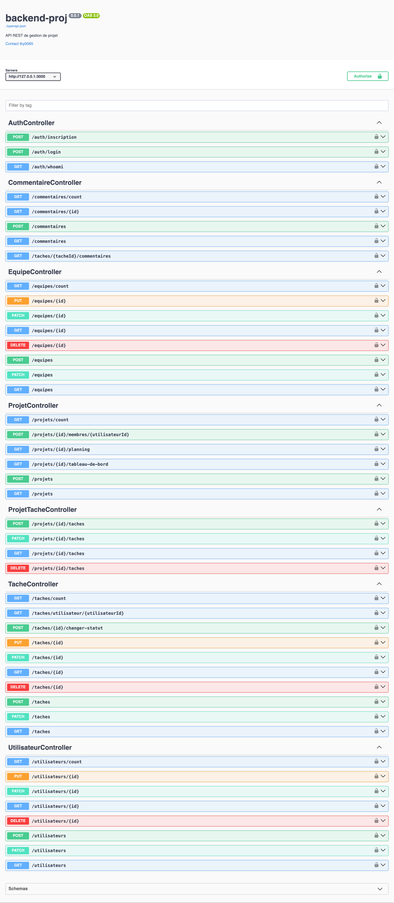

# Système de Gestion de Projet - Backend API

## Description

Ce projet est une API REST complète pour un système de gestion de projet,
développée avec Loopback 4. Elle permet la gestion des projets, des tâches, des
équipes, des utilisateurs et des commentaires, avec un système
d'authentification JWT intégré.

## Demo Image



## Technologies Utilisées

- **Framework**: Loopback 4
- **Langage**: TypeScript
- **Base de données**: Compatible avec plusieurs bases de données via les
  connecteurs Loopback
- **Authentification**: JWT (@loopback/authentication-jwt)
- **Hachage des mots de passe**: bcryptjs

## Prérequis

- Node.js (version 14 ou supérieure)
- npm ou yarn
- TypeScript installé globalement (`npm install -g typescript`)
- Une base de données (par défaut, utilise une base de données en mémoire pour
  le développement)

## Installation

1. Cloner le projet

```bash
git clone <url-du-projet>
cd backend-proj
```

2. Installer les dépendances

```bash
npm install
```

3. Configurer les variables d'environnement

```bash
cp .env.example .env
# Modifier les variables dans .env selon vos besoins
```

4. Lancer le projet en mode développement

```bash
npm run start:dev
```

## Structure du Projet

```
src/
├── controllers/         # Contrôleurs de l'application
├── models/             # Modèles de données
├── repositories/       # Repositories pour l'accès aux données
├── services/          # Services métier
├── datasources/       # Configuration des sources de données
├── sequence.ts        # Séquence personnalisée pour l'authentification
└── application.ts     # Configuration de l'application
```

## Modèles de Données

### Projet

- id: string
- nom: string
- description: string
- dateDebut: date
- dateFin: date
- statut: string
- budget: number

### Tâche

- id: string
- titre: string
- description: string
- dateDebut: date
- dateFin: date
- priorite: string
- statut: string
- projetId: string
- assigneId: string

### Utilisateur

- id: string
- nom: string
- email: string
- role: string
- motDePasse: string
- permissions: string[]

### Equipe

- id: string
- nom: string
- description: string

### Commentaire

- id: string
- contenu: string
- dateCreation: date
- tacheId: string
- auteurId: string

## API Endpoints

### Authentification

```
POST /auth/inscription   # Créer un nouveau compte
POST /auth/login        # Se connecter et obtenir un token JWT
GET  /auth/whoami       # Obtenir les informations de l'utilisateur connecté
```

### Projets

```
GET    /projets             # Liste tous les projets
POST   /projets            # Crée un nouveau projet
GET    /projets/{id}       # Obtient un projet spécifique
PATCH  /projets/{id}       # Met à jour un projet
DELETE /projets/{id}       # Supprime un projet
GET    /projets/{id}/tableau-de-bord  # Statistiques du projet
```

### Tâches

```
GET    /taches             # Liste toutes les tâches
POST   /taches            # Crée une nouvelle tâche
GET    /taches/{id}       # Obtient une tâche spécifique
PATCH  /taches/{id}       # Met à jour une tâche
DELETE /taches/{id}       # Supprime une tâche
POST   /taches/{id}/changer-statut  # Change le statut d'une tâche
```

### Équipes

```
GET    /equipes           # Liste toutes les équipes
POST   /equipes          # Crée une nouvelle équipe
GET    /equipes/{id}     # Obtient une équipe spécifique
PATCH  /equipes/{id}     # Met à jour une équipe
DELETE /equipes/{id}     # Supprime une équipe
```

### Utilisateurs

```
GET    /utilisateurs          # Liste tous les utilisateurs
POST   /utilisateurs         # Crée un nouvel utilisateur
GET    /utilisateurs/{id}    # Obtient un utilisateur spécifique
PATCH  /utilisateurs/{id}    # Met à jour un utilisateur
DELETE /utilisateurs/{id}    # Supprime un utilisateur
```

## Authentification

L'API utilise l'authentification JWT. Pour accéder aux endpoints protégés,
incluez le token JWT dans l'en-tête de la requête :

```
Authorization: Bearer <votre-token>
```

## Exemples d'Utilisation

### Création d'un compte

```bash
curl -X POST http://localhost:3000/auth/inscription \
  -H "Content-Type: application/json" \
  -d '{
    "nom": "John Doe",
    "email": "john@example.com",
    "role": "developpeur",
    "motDePasse": "motdepasse123",
    "permissions": ["utilisateur"]
  }'
```

### Connexion

```bash
curl -X POST http://localhost:3000/auth/login \
  -H "Content-Type: application/json" \
  -d '{
    "email": "john@example.com",
    "motDePasse": "motdepasse123"
  }'
```

### Création d'un projet

```bash
curl -X POST http://localhost:3000/projets \
  -H "Content-Type: application/json" \
  -H "Authorization: Bearer <votre-token>" \
  -d '{
    "nom": "Nouveau Projet",
    "description": "Description du projet",
    "dateDebut": "2024-02-11T00:00:00.000Z",
    "dateFin": "2024-12-31T23:59:59.000Z",
    "statut": "EN_COURS",
    "budget": 10000
  }'
```

## Scripts Disponibles

```bash
npm run build          # Compile le projet
npm run build:watch    # Compile en mode watch
npm run clean         # Nettoie les fichiers de build
npm run start         # Lance l'application
npm run start:dev     # Lance l'application en mode développement
npm run test          # Lance les tests
```

## Tests

Pour exécuter les tests :

```bash
npm test
```

## Documentation API

La documentation Swagger/OpenAPI est disponible à l'adresse :

```
http://localhost:3000/explorer
```

## Contribution

1. Fork le projet
2. Créer une branche pour votre fonctionnalité (
   `git checkout -b feature/nouvelle-fonctionnalite`)
3. Commit vos changements (
   `git commit -m 'Ajout d'une nouvelle fonctionnalité'`)
4. Push vers la branche (`git push origin feature/nouvelle-fonctionnalite`)
5. Ouvrir une Pull Request

## Licence

Ce projet est sous licence MIT. Voir le fichier `LICENSE` pour plus de détails.

## Contact

- Auteur: [Votre Nom]
- Email: [Votre Email]

## Remerciements

- Équipe Loopback
- Contributeurs du projet
